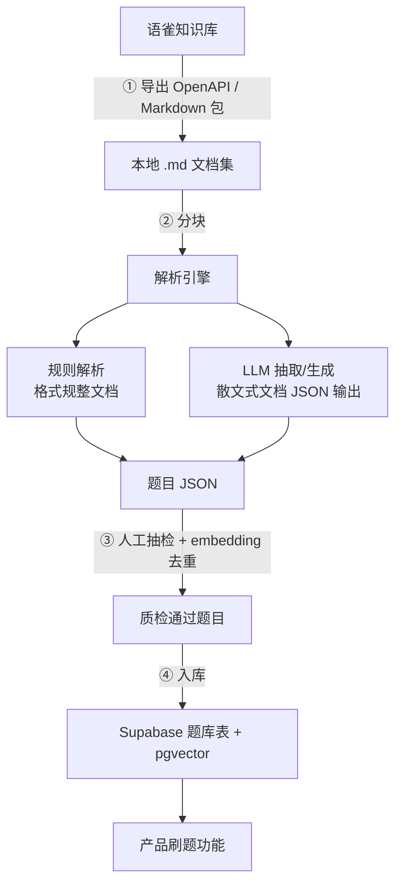

# 语雀知识库转结构化题库 · 方案文档

**目标**：将现有语雀知识库中的非结构化/半结构化文档，批量转换为标准化、可刷题的结构化题库，落地到 Supabase（PostgreSQL \+ pgvector）。

**核心链路**：语雀导出 → 分块解析（规则 \+ LLM）→ 人工质检去重 → 入库 → 接入刷题功能。

---

# 一、背景与目标

现有面试知识沉淀在语雀知识库中，以语雀文档形式存在，缺乏统一结构，无法直接用于产品刷题。本方案的目标是设计一条 **可重复、可质检、可扩展** 的转换流水线，把这些文档转为带分类、标签、难度的标准题目，并为后续「薄弱点 → 题目推荐」预留语义检索能力。

# 二、前置评估：文档结构化程度

转换难度完全取决于源文档的结构化程度，需先对号入座，决定以「解析已有题目」还是「AI 生成新题目」为主。

|文档现状|转换难度|主要手段|
|---|---|---|
|已有明确问答结构（如固定标题/「答案:」标记）|低|正则/规则解析为主，AI 兜底|
|半结构化（有标题层级，问答混在段落里）|中|AI 抽取为主，规则辅助|
|纯散文/笔记（知识点叙述，无明显题目）|高|AI 从知识点反向生成题目|

多数八股知识库属于**中等**结构化程度，需以 LLM 抽取为主、规则解析辅助。

# 三、第一步：从语雀导出文档

|方式|适用场景|说明|
|---|---|---|
|**语雀 OpenAPI（推荐）**|文档量大、需可重复执行|通过 Token 拉取知识库（Repo）文档列表与正文（Markdown/HTML）；流程：列出知识库 → 遍历目录 → 逐篇拉正文|
|批量导出 Markdown 包|一次性迁移，不想接 API|语雀知识库支持导出为 Markdown 压缩包，本地处理|
|单篇复制|文档极少|不推荐用于规模化|

无论哪种方式，最终都应得到一批 `.md` 文件作为后续解析的统一原料。

# 四、第二步：解析为结构化题目（核心）

## 4\.1 统一题目数据结构

|字段|说明|
|---|---|
|`id`|题目唯一 ID|
|`type`|题型：八股 / 面经 / 算法|
|`question`|题干|
|`answer`|标准答案/参考解析|
|`category`|分类（如 机器学习 / 深度学习 / 操作系统）|
|`tags`|标签（可多个，便于薄弱点匹配）|
|`difficulty`|难度（易/中/难）|
|`source_doc`|来源语雀文档（便于溯源、回查）|

## 4\.2 解析策略：规则 \+ AI 结合

- **格式规整的文档** → 写脚本按标记切分（如按标题切题、按「答案:」切答案），成本低、可控

- **散文式知识** → 用 LLM 抽取/生成，强制结构化 JSON 输出，直接产出题目

**LLM 抽取 Prompt 示例**：「你是出题专家。根据以下知识内容，提炼出若干道面试题，每道题包含 question、answer、category、tags、difficulty，以 JSON 数组输出。内容如下：……」

## 4\.3 实操要点

1. **分块处理**：长文档按小节切块再喂模型，避免超长上下文导致质量下降和成本飙升

2. **结构化输出**：强制 JSON Schema 输出，方便直接入库，减少二次清洗

3. **保留来源**：每条题记录 `source_doc`，方便人工复核与回溯

4. **批量 \+ 异步**：文档多时用队列异步跑，避免同步阻塞

# 五、第三步：人工质检 \+ 入库

AI 抽取/生成的题目**不能直接上线**，必须经过质检。八股答案准确性直接影响产品口碑，质检环节不可省。

1. **人工抽检**：随机抽查答案准确性，尤其防范 AI 生成的事实错误或答非所问

2. **去重**：不同文档可能讲同一知识点，按题干相似度（embedding）去重

3. **入库 Supabase**：校验后的 JSON 批量写入题库表；`tags`/`category` 为「薄弱点推荐」打基础；为题干生成 embedding 存入 pgvector 以支持语义推荐

# 六、完整流水线

# 七、务实落地建议

|建议|说明|
|---|---|
|**先小批量验证**|挑 10–20 篇代表性文档跑通全链路，确认 AI 抽取质量与字段设计后再规模化|
|**一次性脚本即可**|这是迁移任务，写 Python 脚本批处理即可，跑完即弃，无需做成产品功能|
|**质检是关键风险点**|八股答案准确性影响口碑，宁可少而精，不要多而错|

---

本方案为迁移工程的总体设计，后续可补充：解析脚本框架（含 LLM Prompt 模板）、Supabase 题库建表 SQL（含 pgvector）等落地物料。

> (注：内容由 AI 生成，请谨慎参考）
